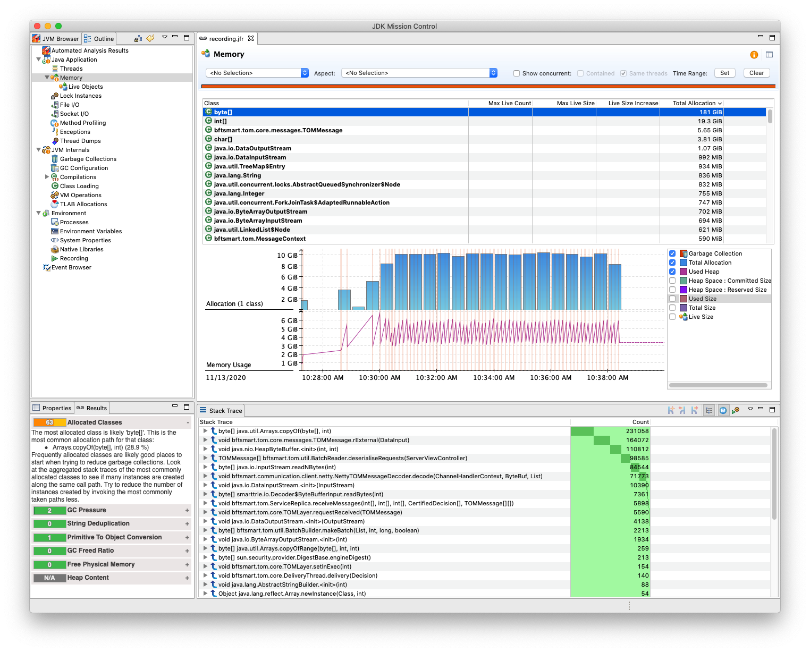

```{r predef, warning=FALSE, include=FALSE}
library(stringr)
library(dplyr)
library(ggplot2)
library(scales)
library(knitr)
library(ggpubr)

load_ycsb_throughput = function(log_file_path) {
  ycsb_lines = regex(
    paste(
      "(\\d{4}-\\d{2}-\\d{2} \\d{2}:\\d{2}:\\d{2}:\\d{3}).*",
      "\\[UPDATE:",
      "Count=(.*),",
      "Max=(.*),",
      "Min=(.*),",
      "Avg=(.*),",
      "90=(.*),",
      "99=(.*),",
      "99.9=(.*),",
      "99.99=(.*)]"
    )
  )

  ycsb = str_match(readLines(log_file_path), ycsb_lines)
  ycsb = ycsb[!is.na(ycsb[, 1]),]
  ycsb = ycsb[,-1]
  colnames(ycsb) = c("ts",
                     "throughput",
                     "max",
                     "min",
                     "avg",
                     "p90",
                     "p99",
                     "p999",
                     "p9999")

  ycsb =
    as_tibble(ycsb) %>%
    mutate(ts = sub("(\\d{2}):(\\d{3})", "\\1.\\2", ts)) %>%
    mutate_at(vars(ts), as.POSIXct) %>%
    mutate_at(vars(throughput, max, min, avg, p90, p99, p999, p9999),
              as.numeric)
}

load_checkpoint_marks = function(server_log_path, start_ts, end_ts, version) {
  if (version == 0) {
    checkpoint_start = "Starting replica checkpoint serialization"
    checkpoint_stop = "Next command occurred after \\d+s since last checkpoint"
  } else {
    checkpoint_start = "Starting replica checkpoint"
    checkpoint_stop = "Checkpoint created after \\d+s"
  }

  checkpoint_lines = regex(
    paste0(
      "(\\d{4}-\\d{2}-\\d{2} \\d{2}:\\d{2}:\\d{2}.\\d{3}).*",
      "(",
      checkpoint_start,
      "|",
      checkpoint_stop,
      ")"
    )
  )

  checkpoints = str_match(readLines(server_log_path), checkpoint_lines)
  checkpoints = checkpoints[!is.na(checkpoints[,1]),-1]
  colnames(checkpoints) = c("ts", "event")

  as_tibble(checkpoints) %>%
    mutate(event = sub(checkpoint_start, "Checkpoint start", event)) %>%
    mutate(event = sub(checkpoint_stop, "Checkpoint stop", event)) %>%
    mutate_at(vars(ts), as.POSIXct) %>%
    mutate_at(vars(event), as.factor) %>%
    filter(ts >= start_ts & ts <= end_ts)
}

load_gc_marks = function(gc_log_path, start_ts, end_ts) {
  gc_lines = regex("\\[(.*)\\+\\d+\\] GC\\(\\d+\\) (.*) \\d+\\w.*->\\d+\\w.*")
  
  pauses = str_match(readLines(gc_log_path), gc_lines)
  pauses = pauses[!is.na(pauses[, 1]), -1]
  colnames(pauses) = c("ts", "type")
  
  as_tibble(pauses) %>%
    mutate(ts = str_replace(ts, "T", " "),
           type = paste("GC", type)) %>%
    mutate_at(vars(ts), as.POSIXct) %>%
    mutate_at(vars(type), as.factor) %>%
    filter(ts >= start_ts & ts <= end_ts)
}

plot_throughput_vs_checkpoints = function(title,
                                         ycsb_log,
                                         server_log = NA,
                                         gc_log = NA,
                                         version = 1) {
  ycsb = load_ycsb_throughput(ycsb_log)
  start = first(ycsb$ts)
  end = last(ycsb$ts)
  
  plot = ggplot() +
    geom_line(data = ycsb, aes(ts, throughput))
  
  if (!is.na(server_log)) {
    checkpoints = load_checkpoint_marks(server_log, start, end, version)
    plot = plot +
      geom_vline(data = checkpoints,
               aes(xintercept = ts, color = event),
               linetype = "dashed")
  }
  
  if (!is.na(gc_log)) {
    gc_pauses = load_gc_marks(gc_log, start, end)
    plot = plot +
      geom_vline(data = gc_pauses,
                 aes(xintercept = ts, color = type),
                 linetype = "dotted")
  }
  
  plot +
    labs(title = title,
         x = "Time",
         y = "Throughput (rps)") +
    scale_color_discrete(name = "Markers:") +
    scale_y_continuous(breaks = pretty_breaks(15)) +
    theme(legend.position = "bottom")
}

plot_gc_analysis = function(title, path, from, to) {
  serverlog = paste0(path, "/client/tmp/SmartTrie/logs/benchmark.log")
  gclog = paste0(path, "/server/tmp/SmartTrie/logs/gc.log")
  start = as.POSIXct(from)
  end = as.POSIXct(to)
  
  ycsb =
    load_ycsb_throughput(serverlog) %>%
    filter(ts >= start & ts <= end)
  
  gc = load_gc_marks(gclog, start, end)
  
  ggplot(ycsb, aes(ts, throughput)) +
    geom_line() +
    geom_vline(data = gc,
               aes(xintercept = ts, colour = "GC Pause"),
               linetype = "dotted") +
    labs(title = title, x = "Time", y = "Throughput (rps)") +
    scale_colour_discrete(name = NULL) +
    scale_fill_discrete(name = NULL) +
    coord_cartesian(ylim = c(0, 12000)) +
    theme(legend.position = "bottom")
}

plot_gc_table = function(...) {
  df = data.frame()
  
  for (row in list(...)) {
    title = row[1]
    path = row[2]
    start = as.POSIXct(row[3])
    end = as.POSIXct(row[4])
    
    serverlog = paste0(path, "/client/tmp/SmartTrie/logs/benchmark.log")

    ycsb =
      load_ycsb_throughput(serverlog) %>%
      filter(ts >= start & ts <= end) %>%
      summarise(
        Mean = round(mean(throughput), 2),
        SD = round(sd(throughput), 2),
        SE = round(sd(throughput) / sqrt(n()), 2)
      ) %>%
      mutate(GC = title) %>%
      select(GC, Mean, SD, SE)

    df = bind_rows(df, ycsb)
  }
  
  ggtexttable(df, rows = NULL)
}

se    = function (x) sd(x) / sqrt(length(x))
pdiff = function (a, b)  (1 - a / b) * 100
prow   = function (a, b) c(a, b, pdiff(a, b))
```

# Experimentos

## 2020-10-09 - Baseline

Criação da baseline com aplicação tradicional. Configurações relevantes:

| Configuração | Valor | Observação |
|---|---|---|
| Servidores vs Clientes | 1/1 | Node 91-92 |
| Escrita vs Leitura | 100/0 | |
| Chaves | 500000 | |
| Requests | 500000 | |
| Threads no cliente | 1 | |
| Bytes/Registro | 4kb | |
| Período de checkpoints | 100000 | |
| Checkpoints assíncrono | Não | |
| Log assíncrono | Sim |
| Estrutura de dados | java.util.TreeMap | |
| Commit | 26544ab | |

Após a carga de dados, o estado em memória atingiu 1967MB (1.92G). Checkpoints levaram entre 30-40 segundos. A vazão da baseline parece irregular nos períodos entre checkpoints, o que motivou a execução com outros tipos de garbage collector. Por padrão a JVM 11 utiliza o algoritmo G1, porém, ZGC aparenta ser o algoritmo mais estável para esta aplicação. Dois bugs foram encontrados: 1) ao tentar executar a aplicação com 1M de chaves, a carga de dados é completada mas, o benchmark tem timeouts em praticamente todas as requisições; 2) ao reiniciar o servidor mantendo os dados persistidos, praticamente todas as requisições resultam em timeout (similar ao problema 1).

```{r experiment-2020-10-09-baseline, echo=FALSE, warning=FALSE}
plot_throughput_vs_checkpoints(
  "Baseline",
  "../results/20201009T132837/node92/tmp/SmartTrie/logs/benchmark.log",
  "../results/20201009T132837/node91/tmp/SmartTrie/logs/app.log",
  version=0
)
```

```{r experiment-2020-10-09-parallel-gc, echo=FALSE, warning=FALSE}
plot_throughput_vs_checkpoints(
  "Baseline + ParallelGC",
  "../results/20201009T140936/node92/tmp/SmartTrie/logs/benchmark.log",
  "../results/20201009T140936/node91/tmp/SmartTrie/logs/app.log",
  version=0
)
```

```{r experiment-2020-10-09-parallel-zgc, echo=FALSE, warning=FALSE}
plot_throughput_vs_checkpoints(
  "Baseline + ZGC",
  "../results/20201009T143012/node92/tmp/SmartTrie/logs/benchmark.log",
  "../results/20201009T143012/node91/tmp/SmartTrie/logs/app.log",
  version=0
)
```

## 2020-10-17 - Reescrita dos Mecanismos de Checkpoint e Log

Nesta iteração, assumimos controle dos mecanismos de checkpoint e log. Para avaliar o impacto de tais componentes, reexecutamos a baseline. A seguir estão as configuração relevantes:

| Configuração | Valor | Observação |
|---|---|---|
| Servidores vs Clientes | 1/1 | Node 91-92 |
| Escrita vs Leitura | 100/0 | |
| Chaves | 500000 | |
| Requests | 500000 | |
| Threads no cliente | 1 | |
| Bytes/Registro | 4kb | |
| Período de Checkpoints | 100000 | |
| Checkpoints assíncrono | Sim/Não | TrieMap é assíncrono, demais são síncronos |
| Log assíncrono | Sim |
| Estrutura de dados | java.util.TreeMap, java.util.concurrent.HashMap, scala.collection.concurrent.TrieMap | |
| Commit | 3d47d90 | |

Iniciamos com a reexecução da baseline, utilizando uma estrutura de dados do tipo Tree-Map, e o algoritmo de GC paralelo. É visível que o tempo de execução do checkpoint diminuiu se comparado com a versão anterior do dia 09, que utiliza os algoritmos do BFT-Smart. No entanto, o comportamento é o mesmo: durante a execução do checkpoint nenhum comando é executado.

```{r experiment-2020-10-17-tree-map, echo=FALSE, message=FALSE, warning=FALSE}
plot_throughput_vs_checkpoints(
  "Baseline",
  "../results/20201017T144634/node92/tmp/SmartTrie/logs/benchmark.log",
  "../results/20201017T144634/node91/tmp/SmartTrie/logs/app.log"
)
```

A título de curiosidade, reexecutamos também a baseline com o algoritmo de ZGC de garbage collector. O resultado foi semelhante ao obtido anteriormente: maior estabilidade apensar de menor vazão. A escolha do algoritmo correto de GC ainda não é clara. Os demais experimentos foram executados com o algoritmo paralelo de GC.

```{r experiment-2020-10-17-tree-map-zgc, echo=FALSE, message=FALSE, warning=FALSE}
plot_throughput_vs_checkpoints(
  "Baseline + ZGC",
  "../results/20201017T142212/node92/tmp/SmartTrie/logs/benchmark.log",
  "../results/20201017T142212/node91/tmp/SmartTrie/logs/app.log"
)
```

A seguir, executamos um experimento similar, apenas variando o tipo da estrutura de um TreeMap (não thread-safe) para um ConcurrentHashMap (thread-safe). A hipótese é que a vazão de uma estrutura não thread-safe pode ser maior que a de uma estrutura thread-safe e, portanto, não seria uma comparação justa com a estrutura thread-safe CTrie. Ambas estruturas variam na mesma faixa de ~1800 a ~2200 RPS, sendo que a TreeMap se mantém mais próximo ao limite superior. Apesar disto, a instabilidade na vazão do serviço em ambos os casos torna difícil chegar a qualquer conclusão.

```{r experiment-2020-10-17-hash-map-parallel-gc, echo=FALSE, warning=FALSE}
plot_throughput_vs_checkpoints(
  "ConcurrentHashMap",
  "../results/20201017T151954/node92/tmp/SmartTrie/logs/benchmark.log",
  "../results/20201017T151954/node91/tmp/SmartTrie/logs/app.log"
)
```

Finalmente, executamos o mesmo experimento com uma estrutura do tipo CTrie, ou TrieMap em scala. Apesar da vazão ainda instável, é possível notar que não há a interrupção total do serviço durante o checkpoint. É interessante observar que ao final dos checkpoints, geralmente ocorre uma grande queda na vazão. Acreditamos que a queda esteja relacionada a uma rotina sincronizada que "trunca" os logs ao final do checkpoint.

```{r experiment-2020-10-17-trie-map-parallel-gc, echo=FALSE, message=FALSE, warning=FALSE}
plot_throughput_vs_checkpoints(
  "Trie",
  "../results/20201017T153644/node92/tmp/SmartTrie/logs/benchmark.log",
  "../results/20201017T153644/node91/tmp/SmartTrie/logs/app.log"
)
```

O experimento com a CTrie se mostra promissor. No entanto, a instabilidade na vazão do serviço dificulta a sua análise. Próximos passos:

* Depurar o código afim de estabilizar a vazão do serviço;
* Reexecutar os experimentos.

<!-- Coleta de dados para depuração: ../results/20201017T121311 -->

## 2020-10-23 - Otimizações de memória e carga de dados

| Configuração | Valor | Observação |
|---|---|---|
| Servidores vs Clientes | 1/1 | Node 41-42 |
| Escrita vs Leitura | 100/0 | |
| Chaves | 500000 | |
| Requests | 5000000 | |
| Threads no cliente | 32 | |
| Bytes/Registro | 4kb | |
| Período de Checkpoints | 100000 | |
| Checkpoints assíncrono | Sim/Não | TrieMap é assíncrono, demais são síncronos |
| Log assíncrono | Sim |
| Estrutura de dados | java.util.TreeMap, java.util.concurrent.HashMap, scala.collection.concurrent.TrieMap | |
| Commit | c4cafdc | |

Neste experimento buscamos avaliar as otimizações feitas para reduzir as pausas de GC durante a execução dos sistema. Além disso, verificamos que os servidores 91 e 92 possuem um número grande de processos parallelos a execução do experimento (aproximadamente 700). Utilizamos, então, os servidores 41 e 42 que possuem memos processos em execução (~130). Aumentamos também o número de theads do benchmark afim de evitar períodos de lock no servidor devido a falta de trabalho a ser executado.

```{r experiment-2020-10-23-tree-map, echo=FALSE, message=FALSE, warning=FALSE}
plot_throughput_vs_checkpoints(
  "Baseline",
  "../results/20201023T095733/client/tmp/SmartTrie/logs/benchmark.log",
  "../results/20201023T095733/server/tmp/SmartTrie/logs/app.log"
)
```

```{r experiment-2020-10-23-hash-map, echo=FALSE, message=FALSE, warning=FALSE}
plot_throughput_vs_checkpoints(
  "ConcurrentHashMap",
  "../results/20201023T102244/client/tmp/SmartTrie/logs/benchmark.log",
  "../results/20201023T102244/server/tmp/SmartTrie/logs/app.log"
)
```

```{r experiment-2020-10-23-trie-map, echo=FALSE, message=FALSE, warning=FALSE}
plot_throughput_vs_checkpoints(
  "Trie",
  "../results/20201023T104449/client/tmp/SmartTrie/logs/benchmark.log",
  "../results/20201023T104449/server/tmp/SmartTrie/logs/app.log"
)
```

Apesar do aumento na vazão, a tempo de serviço continua instável. A variação aumentou em realção aos experimentos ateriores, o que dificulta ainda mais as análises.

## 2020-11-05 - Experimentos sem checkpoint e sem log

| Configuração | Valor | Observação |
|---|---|---|
| Servidores vs Clientes | 1/1 | Node 41-42 |
| Escrita vs Leitura | 100/0 | |
| Chaves | 500000 | |
| Requests | 500000 | |
| Threads no cliente | 1 | |
| Bytes/Registro | 4kb | |
| Período de Checkpoints | 100000 | |
| Checkpoints assíncrono | Sim | |
| Log assíncrono | Sim |
| Estrutura de dados | scala.collection.concurrent.TrieMap | |
| Commit | 686eb73 | Alterações foram feitas no código de maneira experimental (não há commits para cada experimento). |

Para avaliar o impacto dos mecanismos de checkpoint e log na vazão e aparente instabilidade do serviço. Os seguintes experimentos foram executados removendo as rotinas de log e checkpoint.

```{r experiment-2020-11-05-trie-no-ckp-no-log, echo=FALSE, message=FALSE, warning=FALSE}
plot_throughput_vs_checkpoints(
  "Trie - Sem Checkpoint - Sem Log",
  "../results/20201105T091931/client/tmp/SmartTrie/logs/benchmark.log",
  "../results/20201105T091931/server/tmp/SmartTrie/logs/app.log"
)
```

```{r experiment-2020-11-05-trie-ckp-no-log, echo=FALSE, message=FALSE, warning=FALSE}
plot_throughput_vs_checkpoints(
  "Trie - Com Checkpoint - Sem Log",
  "../results/20201105T093940/client/tmp/SmartTrie/logs/benchmark.log",
  "../results/20201105T093940/server/tmp/SmartTrie/logs/app.log"
)
```

```{r experiment-2020-11-05-trie-no-ckp-log, echo=FALSE, message=FALSE, warning=FALSE}
plot_throughput_vs_checkpoints(
  "Trie - Sem Checkpoint - Com Log",
  "../results/20201105T095706/client/tmp/SmartTrie/logs/benchmark.log",
  "../results/20201105T095706/server/tmp/SmartTrie/logs/app.log"
)
```

É interessante perceber que mesmo sem checkpoints e logs, ainda ocorreu um período em que a vazão caiu a zero. O mesmo período não se repetiu nos experimentos seguintes, o que pode indicar que este seja um fator do ambiente, como pausas para GC ou perca de prioridade do SO. No entando, períodos de menor vazão parecem coinsidir com o término de checkpoints. Uma hipótese seria que o snapshot da CTrie criada em memória durante o checkpoint é descartado neste momento, liberando um espaço de memória significativo, o que pode disparar uma pausa de GC. Acredito que podemos remover o log a fim de reduzir as variáveis que podem impactar a vazão. Seria interessnate executar experimentos maiores, coletando uma média de vazão por alguns segundos, reduzindo assim a variação e focando as análises no seu valor médio ao longo do tempo.

## 2020-11-12 - Análize do impacto dos coletores de lixo

| Configuração | Valor | Observação |
|---|---|---|
| Servidores vs Clientes | 1/1 | Node 41-42 |
| Escrita vs Leitura | 100/0 | |
| Chaves | 500000 | |
| Requests | 5000000 | |
| Threads no cliente | 64 | |
| Bytes/Registro | 4kb | |
| Período de Checkpoints | 100000 | |
| Checkpoints assíncrono | Sim | |
| Log assíncrono | - | Log desabilitado |
| Estrutura de dados | scala.collection.concurrent.TrieMap | |
| Commit | 20110f9 | |

Neste experimento, removemos a rotina de log a fim de minimizar o número de variáveis que possam alterar a vazão. Comparamos em detalhe a execução do sistema com diferentes algoritmos de coleção. O primeiro experimento foi executado com o algoritmo ParallelGC, onde é possível observar quedas expressivas na vasão do serviço. Ao cruzar a vazão com as pausas de GC, é possível perceber que grandes quedas estão relacionadas a pausas longas do tipo "GC Pause Full".

```{r experiment-2020-11-12-trie-parallel-gc, echo=FALSE, message=FALSE, warning=FALSE}
plot_throughput_vs_checkpoints(
  "Trie - ParallelGC",
  "../results/20201112T094313/client/tmp/SmartTrie/logs/benchmark.log",
  "../results/20201112T094313/server/tmp/SmartTrie/logs/app.log",
  "../results/20201112T094313/server/tmp/SmartTrie/logs/gc.log"
) + guides(colour = guide_legend(nrow = 2))
```

No experimento seguinte, avaliamos o desempenho ao escolher o algoritmo G1. É possível notar que este algoritmo passa por ciclos compostos de pequenas pausas que se tornam cada vez mais frequetes até um determinado limite onde pausas mais expressivas de GC são executadas o que resulta em períodos de menor vazão, ao contrário dos picos de baixa vazão encontrados no algoritmo ParallelGC.

```{r experiment-2020-11-12-trie-g1-gc, echo=FALSE, message=FALSE, warning=FALSE}
plot_throughput_vs_checkpoints(
  "Trie - G1",
  "../results/20201112T101439/client/tmp/SmartTrie/logs/benchmark.log",
  "../results/20201112T101439/server/tmp/SmartTrie/logs/app.log",
  "../results/20201112T101439/server/tmp/SmartTrie/logs/gc.log"
) + guides(colour = guide_legend(nrow = 4))
```

Finalmente, re-executamos o mesmo experimento com o algoritmo ZGC. Este algoritmo apresenta pausas frequentes, o que resulta em uma maior desvio padrão, porém não há momentos de queda expressiva na vazão se comparado com os algoritmos anteriores.

```{r experiment-2020-11-12-trie-zgc, echo=FALSE, message=FALSE, warning=FALSE}
plot_throughput_vs_checkpoints(
  "Trie - ZGC",
  "../results/20201112T114719/client/tmp/SmartTrie/logs/benchmark.log",
  "../results/20201112T114719/server/tmp/SmartTrie/logs/app.log",
  "../results/20201112T114719/server/tmp/SmartTrie/logs/gc.log"
)
```

Ao aumentar o tamanho máximo da memória de 6G para 8G, o ZGC preserva o desvio padrão, mas aumenta o periodo entre GCs.

```{r experiment-2020-11-13-trie-zgc-8G, echo=FALSE, message=FALSE, warning=FALSE}
plot_throughput_vs_checkpoints(
  "Trie - ZGC",
  "../results/20201113T090532/client/tmp/SmartTrie/logs/benchmark.log",
  "../results/20201113T090532/server/tmp/SmartTrie/logs/app.log",
  "../results/20201113T090532/server/tmp/SmartTrie/logs/gc.log"
)
```

Java flight recorder aponta para arrays de bytes como maior fonte de alocação. BFT-Smart, ao adotar arrays de bytes como estrutura base para representação de dados acaba por colocar muita pressão nos coletores de lixo uma vez que esta estrutura não pode ser reutilizada. A re-engenharia do BFT para utilizaar byte buffers reutilizáveis (pooled) pode amenizar este problema.

```{r experiment-2020-11-13-trie-zgc-8G-jfr, eval=FALSE, message=FALSE, warning=FALSE, include=FALSE}
# Coleta de JFR em: ../results/20201113T092804/server/tmp/SmartTrie/recording.jfr
plot_throughput_vs_checkpoints(
  "Trie - ZGC 8G",
  "../results/20201113T092804/client/tmp/SmartTrie/logs/benchmark.log",
  "../results/20201113T092804/server/tmp/SmartTrie/logs/app.log",
  "../results/20201113T092804/server/tmp/SmartTrie/logs/gc.log"
)
```

```{r experiment-2020-11-13-trie-zgc-8G-img, echo=FALSE, message=FALSE, warning=FALSE}

```


## 2020-11-19 - Experimentos de longa duração

| Configuração | Valor | Observação |
|---|---|---|
| Servidores vs Clientes | 1/1 | Node 41-42 |
| Escrita vs Leitura | 100/0 | |
| Chaves | 1500000 | |
| Requests | 20000000 | |
| Threads no cliente | 64 | |
| Bytes/Registro | 4kb | |
| Período de Checkpoints | 100000 | |
| Checkpoints assíncrono | Sim | |
| Log assíncrono | - | Log desabilitado |
| Estrutura de dados | java.util.TreeMap e scala.collection.concurrent.TrieMap | |
| Commit | ce0d34d | |

Re-executamos os experimentos anteriores por maior duração a fim de coletar dados suficientes para escolher recortes que demostrem a execução dos sitema com vários checkpoints sendo criados. Para tal fim, aumentamos o tamanho do dataset para 5G e executamos 20M de requests variando a estrutura de dados. Nestes experimentos utilizamos o coletor de lixo ZGC com uma heap de 16G.

```{r experiment-2020-11-19-tree-map, echo=FALSE, message=FALSE, warning=FALSE}
plot_throughput_vs_checkpoints(
  "TreeMap",
  "../results/20201119T104524/client/tmp/SmartTrie/logs/benchmark.log",
  "../results/20201119T104524/server/tmp/SmartTrie/logs/app.log",
  # "../results/20201119T104524/server/tmp/SmartTrie/logs/gc.log"
) + scale_x_datetime(breaks = pretty_breaks(10))
```

```{r experiment-2020-11-19-trie-map, echo=FALSE, message=FALSE, warning=FALSE}
plot_throughput_vs_checkpoints(
  "Trie",
  "../results/20201119T113910/client/tmp/SmartTrie/logs/benchmark.log",
  "../results/20201119T113910/server/tmp/SmartTrie/logs/app.log",
  # "../results/20201119T113910/server/tmp/SmartTrie/logs/gc.log"
) + scale_x_datetime(breaks = pretty_breaks(10))
```

## 2020-12-07 - Coleta de dados de GC para o artigo final

| Configuração | Valor | Observação |
|---|---|---|
| Servidores vs Clientes | 1/1 | Node 41-42 |
| Escrita vs Leitura | 100/0 | |
| Chaves | 1500000 | |
| Requests | 20000000 | |
| Threads no cliente | 64 | |
| Bytes/Registro | 4kb | |
| Período de Checkpoints | 100000 | |
| Checkpoints assíncrono | Sim | |
| Log assíncrono | - | Log desabilitado |
| Estrutura de dados | java.util.TreeMap e scala.collection.concurrent.TrieMap | |
| Commit | ce0d34d | |

Repetimos o experimento anterior apenas coletando dados de GC da baseline utilizando G1 e Parallel GC para fins de comparação no artigo final.

```{r experiment-2020-12-07-tree-map-g1, echo=FALSE, message=FALSE, warning=FALSE}
plot_throughput_vs_checkpoints(
  "TreeMap + G1 GC",
  "../results/20201207T100117/client/tmp/SmartTrie/logs/benchmark.log",
  "../results/20201207T100117/server/tmp/SmartTrie/logs/app.log",
  # "../results/20201207T100117/server/tmp/SmartTrie/logs/gc.log"
) + scale_x_datetime(breaks = pretty_breaks(10))
  # coord_cartesian(xlim=c(as.POSIXct("2020/12/07 14:21:55"), as.POSIXct("2020/12/07 14:25:30")))
```

```{r experiment-2020-12-07-tree-map-parallel, echo=FALSE, message=FALSE, warning=FALSE}
plot_throughput_vs_checkpoints(
  "TreeMap + ParallelGC",
  "../results/20201207T120308/client/tmp/SmartTrie/logs/benchmark.log",
  "../results/20201207T120308/server/tmp/SmartTrie/logs/app.log",
  # "../results/20201207T120308/server/tmp/SmartTrie/logs/gc.log"
) + scale_x_datetime(breaks = pretty_breaks(10))
  # coord_cartesian(xlim=c(as.POSIXct("2020/12/07 16:22:50"), as.POSIXct("2020/12/07 16:26:25")))
```

## 2021-01-31 - Análise estatística

_Não houveram novos experimentos._

### Vazão em relação ao algoritmo de GC utilizado.

```{r gc-analysis-fig, echo=FALSE, message=FALSE, warning=FALSE}
fig = ggarrange(
  plot_gc_analysis(
    "G1 GC",
    "../results/20201207T100117",
    "2020/12/07 14:21:45",
    "2020/12/07 14:25:56"
  ),
  plot_gc_analysis(
    "Parallel GC",
    "../results/20201207T120308",
    "2020/12/07 16:22:16",
    "2020/12/07 16:26:40"
  ),
  plot_gc_analysis(
    "Z GC",
    "../results/20201119T104524",
    "2020/11/19 15:12:02",
    "2020/11/19 15:15:39"
  ),
  plot_gc_table(
    c(
      "G1",
      "../results/20201207T100117",
      "2020/12/07 14:21:45",
      "2020/12/07 14:25:56"
    ),
    c(
      "Parallel",
      "../results/20201207T120308",
      "2020/12/07 16:22:16",
      "2020/12/07 16:26:40"
    ),
    c(
      "Z",
      "../results/20201119T104524",
      "2020/11/19 15:12:02",
      "2020/11/19 15:15:39"
    )
  ),
  common.legend = TRUE,
  legend = "bottom"
)
```

```{r gc-analysis, echo=FALSE, message=FALSE, warning=FALSE}
fig # work arround blank plot issue
```


### Vazão média em relação ao modelo de concorrência

```{r blocking-vs-non-blocking, echo=FALSE, message=FALSE, warning=FALSE}
plot_blocking_vs_non_blocking = function () {
  tree_map = load_ycsb_throughput("../results/20201119T104524/client/tmp/SmartTrie/logs/benchmark.log")
  trie_map = load_ycsb_throughput("../results/20201119T113910/client/tmp/SmartTrie/logs/benchmark.log")
  
  tibble(
    Model = c("Blocking", "Non-Blocking", "-"),
    Mean  = prow(mean(tree_map$throughput), mean(trie_map$throughput)),
    SD    = prow(sd(tree_map$throughput), sd(trie_map$throughput)),
    SE    = prow(se(tree_map$throughput), se(trie_map$throughput))
  ) %>% mutate(across(where(is.double), round, 2))
}

kable(plot_blocking_vs_non_blocking())
```

### Vazão média fora e dentro de checkpoints

```{r throughput-break-down, echo=FALSE, message=FALSE, warning=FALSE}
plot_non_blocking_breakdown = function () {
  bench = load_ycsb_throughput("../results/20201119T113910/client/tmp/SmartTrie/logs/benchmark.log")
  
  cout = 
    bench %>% 
      filter(ts < as.POSIXct("2020-11-19 15:46:36") | ts > as.POSIXct("2020-11-19 15:47:24")) %>% 
      filter(ts < as.POSIXct("2020-11-19 15:51:25") | ts > as.POSIXct("2020-11-19 15:52:13")) %>% 
      filter(ts < as.POSIXct("2020-11-19 15:56:02") | ts > as.POSIXct("2020-11-19 15:56:51")) %>% 
      filter(ts < as.POSIXct("2020-11-19 16:00:45") | ts > as.POSIXct("2020-11-19 16:01:36")) %>% 
      filter(ts < as.POSIXct("2020-11-19 16:05:30") | ts > as.POSIXct("2020-11-19 16:06:20")) %>% 
      filter(ts < as.POSIXct("2020-11-19 16:09:58") | ts > as.POSIXct("2020-11-19 16:10:48")) %>% 
      filter(ts < as.POSIXct("2020-11-19 16:14:48") | ts > as.POSIXct("2020-11-19 16:15:38")) %>% 
      filter(ts < as.POSIXct("2020-11-19 16:19:35") | ts > as.POSIXct("2020-11-19 16:20:24"))
  
  cin =
    bench %>% 
      filter(
        (ts >= as.POSIXct("2020-11-19 15:46:36") & ts <= as.POSIXct("2020-11-19 15:47:24")) |
        (ts >= as.POSIXct("2020-11-19 15:51:25") & ts <= as.POSIXct("2020-11-19 15:52:13")) |
        (ts >= as.POSIXct("2020-11-19 15:56:02") & ts <= as.POSIXct("2020-11-19 15:56:51")) |
        (ts >= as.POSIXct("2020-11-19 16:00:45") & ts <= as.POSIXct("2020-11-19 16:01:36")) |
        (ts >= as.POSIXct("2020-11-19 16:05:30") & ts <= as.POSIXct("2020-11-19 16:06:20")) |
        (ts >= as.POSIXct("2020-11-19 16:09:58") & ts <= as.POSIXct("2020-11-19 16:10:48")) |
        (ts >= as.POSIXct("2020-11-19 16:14:48") & ts <= as.POSIXct("2020-11-19 16:15:38")) |
        (ts >= as.POSIXct("2020-11-19 16:19:35") & ts <= as.POSIXct("2020-11-19 16:20:24")))
  
  tibble(
    Checkpoint = c("Out", "In", "-"),
    Mean       = prow(mean(cout$throughput), mean(cin$throughput)),
    SD         = prow(sd(cout$throughput), sd(cin$throughput)),
    SE         = prow(se(cout$throughput), se(cin$throughput))
  ) %>% mutate(across(where(is.double), round, 2))
}

kable(plot_non_blocking_breakdown())
```

## 2021-12-15 - Ponto de saturação do sistema

| Configuração | Valor | Observação |
|---|---|---|
| Servidores vs Clientes | 1/1 | Node 41-42 |
| Escrita vs Leitura | 100/0 | |
| Chaves | 1500000 | |
| Requests | 5000000 | |
| Threads no cliente | 1-512 | |
| Bytes/Registro | 4kb | |
| Período de Checkpoints | NA | |
| Checkpoints assíncrono | NA | |
| Log assíncrono | - | Log desabilitado |
| Estrutura de dados | java.util.TreeMap e scala.collection.concurrent.TrieMap | |
| Commit | ce0d34d | 275a205 |

Neste experimento buscamos encontrar o ponto de saturação do sistema variando o número de threads em um sistema com checkpoints desligados.


```{r system-saturation-point-throughput, echo=FALSE, message=FALSE, warning=FALSE}
benchmarks = tibble()

for (model in c("tree-map", "trie-map")) {
  for (th in c("001",
               "002",
               "004",
               "008",
               "016",
               "032",
               "064",
               "128",
               "256",
               "512")) {
    basepath = "../results/20210215/"
    benchpath = "/client/tmp/SmartTrie/logs/benchmark.log"
    path = paste0(basepath, model, "/", th, benchpath)
    
    ycsb =
      load_ycsb_throughput(path) %>%
      summarise_at(vars(throughput, p99), mean) %>%
      mutate(threads = as.factor(as.numeric(th)),
             model = as.factor(model),
             p99 = p99 / 1000) # us to ms
    
    
    benchmarks = bind_rows(benchmarks, ycsb)
  }
}

ggplot(benchmarks, aes(threads, throughput, group = model, color = model)) +
  geom_point() +  geom_line() + scale_y_continuous(breaks = pretty_breaks(15))
```

```{r system-saturation-point-latency, echo=FALSE, message=FALSE, warning=FALSE}
ggplot(benchmarks, aes(threads, p99, group=model, color = model)) +
  geom_point() +  geom_line() + scale_y_continuous(breaks = pretty_breaks(15))
```

```{r system-saturation-point-latency, echo=FALSE, message=FALSE, warning=FALSE}
benchmarks

ggplot(benchmarks, aes(throughput, p99, color=model, group=model)) +
  geom_point() + geom_line() + 
  scale_y_continuous(breaks = pretty_breaks(15)) +
  scale_x_continuous(breaks = pretty_breaks(15))
```